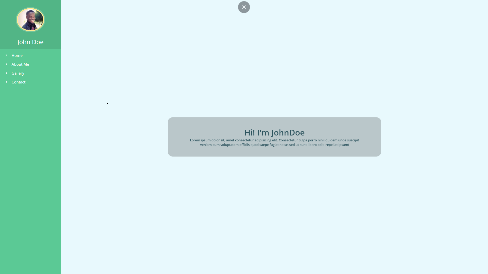

## About

Simple portfolio templated based on ReactJS.
This project created  with [Create React App](https://github.com/facebook/create-react-app).

## Screenshots

## Usage

In the project directory, you can run:

#### `yarn start`
or
#### `npm start`

Runs the app in the development mode. 
Open [http://localhost:3000](http://localhost:3000) to view it in the browser.

## Learn More about React

You can learn more in the [Create React App documentation](https://facebook.github.io/create-react-app/docs/getting-started).

To learn React, check out the [React documentation](https://reactjs.org/).

### Deployment

This section has moved here: https://facebook.github.io/create-react-app/docs/deployment

### `yarn build` fails to minify

This section has moved here: https://facebook.github.io/create-react-app/docs/troubleshooting#npm-run-build-fails-to-minify

Be lucky:D

### License
Standt GNU v3.0  License
